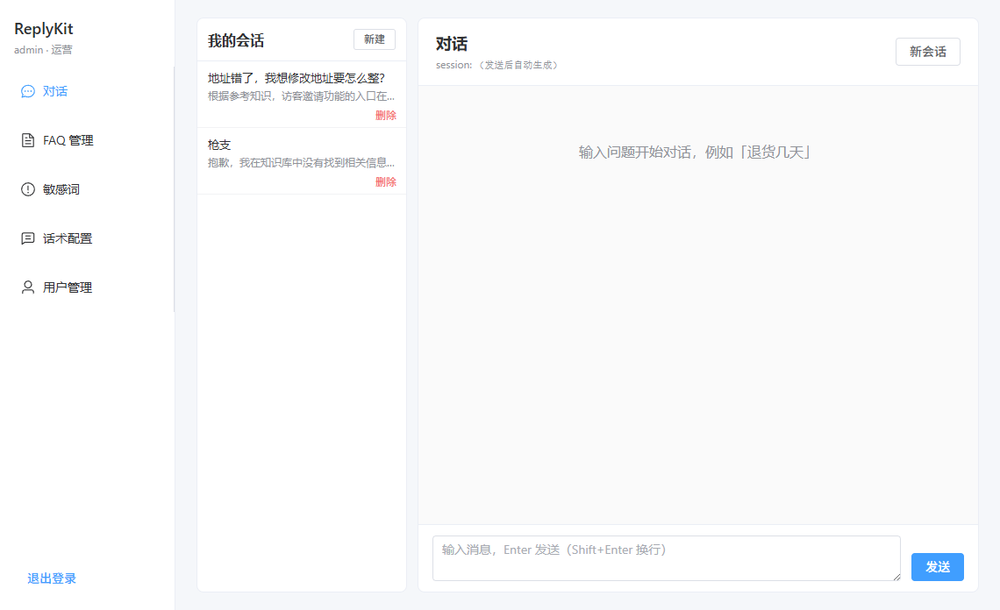
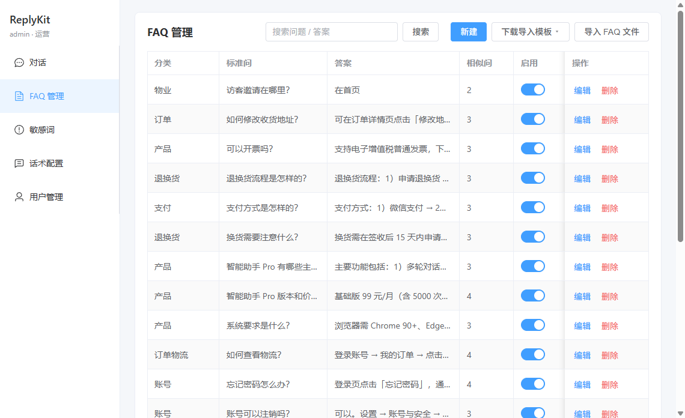
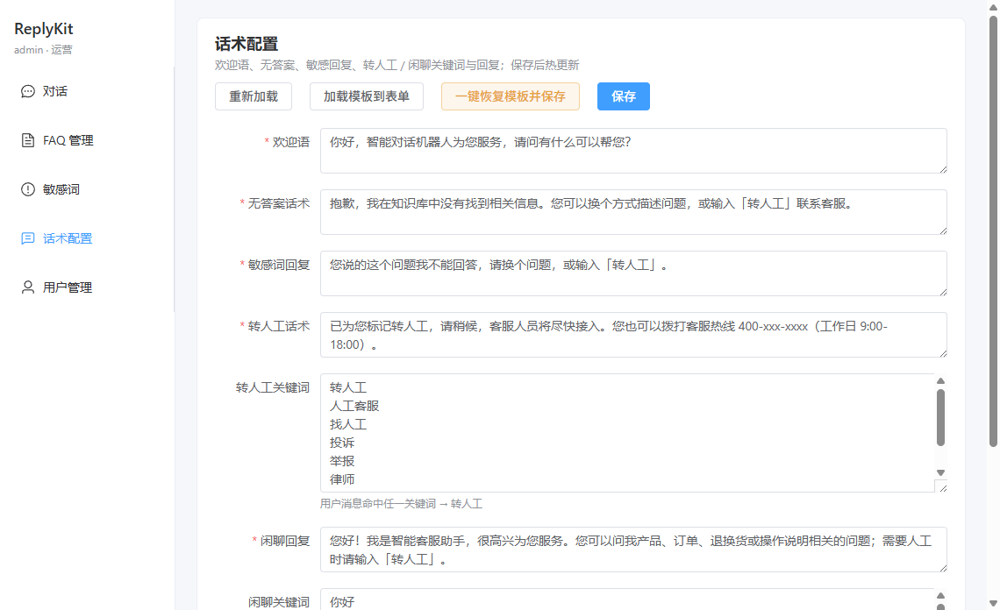

# ReplyKit

基于通义大模型 + 本地 RAG 的智能客服 Agent（FastAPI + Vue 3）。

支持 FAQ 检索（混合检索 / 精排）、澄清与直出、敏感词、话术热更新、运营后台，以及可选的企业微信回调。

## 界面预览

对话页：



FAQ 管理：



话术配置：



## 功能概览

- **对话**：意图识别 → FAQ 检索 → 直出 / 澄清 / LLM 润色
- **知识库**：FAQ 增删改、导入（JSON / CSV / TXT / Excel）、重建向量库
- **运营**：敏感词、话术配置、用户管理（JWT：`user` / `ops`）
- **可选**：企业微信回调；飞书事件回调 + 任务中心「我负责的」查询（需用户 OAuth）
- **前端**：对话页、FAQ / 敏感词 / 话术 / 用户管理 / 渠道配置（`web/`）

## 页面

image.png
image.png

## 环境要求

- Python **3.11+**（`<3.13`）
- Node.js **18+**（前端）
- [uv](https://github.com/astral-sh/uv)（推荐）或 pip
- 通义 DashScope API Key（[百炼控制台](https://bailian.console.aliyun.com)）

## 快速开始

### 1. 克隆与依赖

```bash
git clone https://github.com/icool-ai/agent.git
cd agent
uv sync
```

### 2. 配置环境变量

```bash
cp .env.example .env
```

编辑 `.env`，至少填写：

- `DASHSCOPE_API_KEY` / `OPENAI_API_KEY`
- `JWT_SECRET`（≥32 字符）
- `ADMIN_USERNAME` / `ADMIN_PASSWORD`

其余项可参考 `.env.example` 注释。

### 3. 启动 API

```bash
uv run replykit
# 或：uv run replykit-api
```

默认：`http://127.0.0.1:8000`。健康检查：`GET /health`。

### 4. 启动前端（可选）

```bash
cd web
npm install
npm run dev
```

浏览器打开 http://127.0.0.1:5173 ，用 `.env` 中的管理员账号登录。开发时 Vite 将 `/api/*` 代理到后端。

### 5. 导入 FAQ 示例

仓库自带示例：`data/faq/faq.json`。可通过运营后台「FAQ」页导入，或调用：

```bash
# 登录后携带 Authorization: Bearer <token>
POST /faqs/import
{"path": "data/faq/faq.json"}
```

导入后如需重建向量：`POST /faqs/rebuild`。

## 常用命令

| 命令                                        | 说明         |
| ------------------------------------------- | ------------ |
| `uv run replykit`                           | 启动 API     |
| `uv run python -m src.regression`           | 跑回归用例   |
| `uv run python -m src.chat_log --limit 100` | 导出对话日志 |

前端页面说明见 [`web/README.md`](web/README.md)；FAQ 数据格式见 [`data/faq/README.md`](data/faq/README.md)。

## 项目结构（简）

```
├── main.py              # API 入口
├── src/                 # 后端（聊天、RAG、鉴权、FAQ 等）
├── web/                 # Vue 3 运营 / 对话前端
├── data/
│   ├── faq/             # FAQ 示例与说明（可入库）
│   ├── bot_config.json  # 话术等配置
│   └── *.db             # 运行时 SQLite（本地生成，不入库）
├── .env.example         # 环境变量模板
└── docs/                # 方案与开发笔记
```

运行时数据库（会话、FAQ、敏感词、鉴权、对话日志等）会写在 `data/*.db`，已由 `.gitignore` 忽略，**请勿提交真实业务数据**。

## 鉴权

1. `POST /auth/login` 获取 JWT
2. 请求头：`Authorization: Bearer <access_token>`
3. 角色：`user`（可自助注册，由 `AUTH_ALLOW_REGISTER` 控制）/ `ops`（运营）

## 飞书任务查询（可选）

在飞书对机器人说自然语言即可查询任务中心（仅限**当前授权用户有权限看到**的数据）：

- 「我有哪些未完成的任务」→ 我负责的
- 「所有任务 / 不是我负责的」→ 你有权限看到的全部任务（不限执行人）
- 「帮我看看辰子任务情况」→ 按成员（意图 LLM 抽人名 + 搜人）
- 「查一下张三的未完成任务」→ 按成员（search + assignee）
- 「有哪些清单」→ 可读任务清单
- 「看看【项目A】清单 / 看板」→ 清单任务或按分组（看板列）汇总
- 「看看现在有哪些任务」（未指明范围）→ 先澄清再查

任务子类型优先由意图模型输出的 `task_scope` / `person_name` 等槽位决定；模型失败时回退关键词规则。

配置步骤：

1. 开放平台开通并发布：`task:task:read`、`task:tasklist:read`、`task:section:read`、`contact:user:search`、`offline_access`
2. `.env` 配置公网 `ASSET_BASE_URL`；重定向 URL 填 `{ASSET_BASE_URL}/oauth/feishu/callback`
3. 首次查询点授权链接；**权限升级后需重新授权一次**
4. 网页 `/chat` 触发同类意图时会提示去飞书使用（无飞书身份）

无法查看你无权访问的他人私密任务。

## License

本项目采用 [MIT License](LICENSE)。
